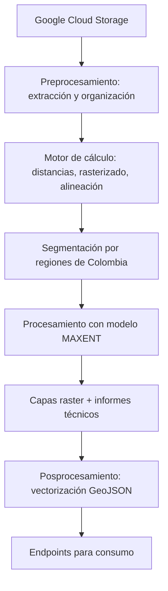

    

<h1 align="center">
    Configuración del sistema de automatización del mapa de vulnerabilidad faunísitca del INVIAS
</h1>

<h3>
Este sistema automatiza la generación de mapas de vulnerabilidad faunística en vías de Colombia, integrando procesos de **preprocesamiento**, **procesamiento** y **posprocesamiento** para producir capas raster y vectores geoespaciales listos para su consumo.
</h3>

---

## Componentes del sistema

### 1. Preprocesamiento
- Conexión a un **bucket de Google Cloud Storage** mediante la API.
- Conexión a fuentes paralelas por medio de:
    - REST
    - FTP
- Extracción y organización de la información en directorios estructurados.
- Motor de cálculo de:
  - **Distancias**
  - **Rasterizado**
  - **Alineación**

### 2. Procesamiento
- Distribución de la información alineada en directorios segmentados por **regiones geográficas de Colombia**.
- Uso del modelo **MAXENT** para procesar los insumos.
- Generación de **capas raster** con niveles de riesgo en vías.
- Producción de un **informe técnico** por cada región.

### 3. Posprocesamiento
- Función de **vectorización** (transformación a **GeoJSON**).
- Almacenamiento en **endpoints** para consumo o despliegue.

---

## Tecnologías utilizadas

- **Python 3.10.19**
- **Django 5.2.7**
- **Conda 25.11.0**
- **Pip 25.2.0**
- **R-base 2020.2**
- **Google Cloud Storage API 16.0**

---

## Librerías requeridas

- Procesador [[requirements.txt](https://github.com/Mapa-INVIAS/central_system_infraestructure/blob/c3d619b8720088a8695c9696f7724517cf1f1778/requirements.txt)]

## Flujo general del sistema

## Pasos para instalación de R en el server

- sudo apt update
- sudo apt install --no-install-recommends software-properties-common dirmngr -y

- wget -qO- https://cloud.r-project.org/bin/linux/ubuntu/marutter_pubkey.asc | sudo tee -a /etc/apt/trusted.gpg.d/cran_ubuntu_key.asc

- sudo add-apt-repository "deb https://cloud.r-project.org/bin/linux/ubuntu noble-cran40/"

- sudo apt update
- sudo apt install r-base r-base-dev -y

## Pasos para correr el entorno de trabajo Django

- python3 -m venv venv
- pip install -r requirements.txt
- python -m manage.py runserver

## Crear el entorno de trabajo con conda

- python convert_txt_to_yml.py requirements.txt environment.yml mi_entorno
- conda env create -f environment.yml

## Paso con conda
- ir a https://docs.conda.io/en/latest/miniconda.html
https://www.anaconda.com/download

- conda --version

- conda create -n r_env python=3.10 r-base rpy2 -c conda-forge

- conda activate r_env

- python script.py

## Instalación de paquetes del proyecto con Conda

- conda install -c conda-forge r_env [package] <!-- verificar cuales son las librerias que se requieren instalar o correr el archivo requirements.txt en conda -->
conda install conda-forge::[package] <!-- Para el caso de esta configuración -->
- conda activate r_env

## Creación de archivo de requisitos

- pip freeze > requirements.txt
- conda list --export > requirements.txt

## Instalación de librerias del proyecto en el entorno virtual

- pip install -r requirements.txt
- conda install --file requirements.txt

## Permisos de acceso

- earthengine authenticate <!-- Esta línea se debe ejecutar en la terminal -->

<!-- Verificar en el folder que se crearon las credenciales -->

- ~/.config/earthengine/credentials

<!-- Se correr este comando en la shell -->
- export GOOGLE_APPLICATION_CREDENTIALS="/credentials/credentials.json"
<!-- Para que sea permanente -->
- setx GOOGLE_APPLICATION_CREDENTIALS "ruta\credentials\credentials.json"

