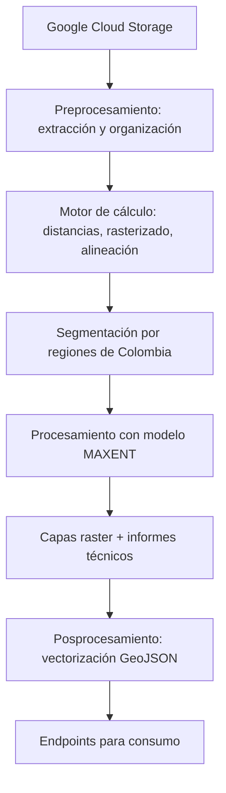

    

<h1 align="center">
    Configuración del sistema de automatización del mapa de vulnerabilidad faunísitca del INVIAS
</h1>

<h3>
Este sistema automatiza la generación de mapas de vulnerabilidad faunística en vías de Colombia, integrando procesos de **preprocesamiento**, **procesamiento** y **posprocesamiento** para producir capas raster y vectores geoespaciales listos para su consumo.
</h3>

---

## Componentes del sistema

### 1. Preprocesamiento
- Conexión a un **bucket de Google Cloud Storage** mediante la API.
- Conexión a fuentes paralelas por medio de:
    - REST
    - FTP
- Extracción y organización de la información en directorios estructurados.
- Motor de cálculo de:
  - **Distancias**
  - **Rasterizado**
  - **Alineación**

### 2. Procesamiento
- Distribución de la información alineada en directorios segmentados por **regiones geográficas de Colombia**.
- Uso del modelo **MAXENT** para procesar los insumos.
- Generación de **capas raster** con niveles de riesgo en vías.
- Producción de un **informe técnico** por cada región.

### 3. Posprocesamiento
- Función de **vectorización** (transformación a **GeoJSON**).
- Almacenamiento en **endpoints** para consumo o despliegue.

---

## Tecnologías utilizadas

- **Python 3.10.19**
- **Django 5.2.7**
- **Conda 25.11.0**
- **Pip 25.2.0**
- **R-base 2020.2**
- **Google Cloud Storage API 16.0**

---

## Librerías requeridas

- Procesador [[requirements.txt](https://github.com/Mapa-INVIAS/central_system_infraestructure/blob/c3d619b8720088a8695c9696f7724517cf1f1778/requirements.txt)]

## Flujo general del sistema

## Pasos para instalación de R en el serveridor

- sudo apt update
- sudo apt install --no-install-recommends software-properties-common dirmngr -y
- wget -qO- https://cloud.r-project.org/bin/linux/ubuntu/marutter_pubkey.asc | sudo tee -a /etc/apt/trusted.gpg.d/cran_ubuntu_key.asc
- sudo add-apt-repository "deb https://cloud.r-project.org/bin/linux/ubuntu noble-cran40/"
- sudo apt update
- sudo apt install r-base r-base-dev -y

## Paso con conda
- ir a https://docs.conda.io/en/latest/miniconda.html
       https://www.anaconda.com/download
- conda create -n r_env python=3.10 r-base rpy2 -c conda-forge
- conda activate r_env <!-- Activacion del entorno -->
- conda deactivate r_env <!-- Desactivación el entorno -->

## Instalación de librerias del proyecto en el entorno virtual

- conda --version <!-- Verificar versión de conda -->
- conda env create -f environment.yml <!-- Creación del entorno virtual -->
- conda create --name r_env --file requirements.txt <!-- Creación del entorno con los requerimientos -->
- conda env update -f environment.yml <!-- Actualización del entorno virtual -->
- conda env list <!-- Listar los entornos virtuales y verificar si existe el reciencreado -->
- conda activate r_env <!-- Activación del entorno de virtual -->
- conda update --all <!-- Actualización de todo el entorno -->

## Creación de archivo de requisitos

- conda list --export > requirements.txt
- Ejecutar el [[make_yml.py])(https://github.com/Mapa-INVIAS/central_system_infraestructure/blob/main/make_yml.py)] <!-- Código para generación del environment.yml -->
- conda env export > environment.yml <!-- Exporta la configuración del entorno -->
- python make_yml.py requirements.txt environment.yml r_env <!-- Modo de ejecución código make_yml.py | r_env es el entorno -->
- conda env create -f environment.yml
- conda env update -f environment.yml <!-- Instalación de paquetes faltantes y actualización de versiones distintintas -->
### Ideal
- conda env export --from-history > environment.yml <!-- Solo genera las dependencias relevantes -->
- conda list | awk '{print $1}' > requirements.txt <!-- Genera las dependiencias sin verión -->
- conda env export --from-history | grep -v "^prefix:" > environment.yml <!-- Genera las dependendencias sin versión -->

## Pasos para correr el entorno de trabajo Django

- python -m manage.py runserver <!-- Desplegar en el puerto por defecto 8000  -->
- python manage.py runserver 8080 <!-- Desplegar en el puerto 8080 -->

## Permisos de acceso

- earthengine authenticate <!-- Esta línea se debe ejecutar en la terminal -->
- ~/.config/earthengine/credentials <!-- Verificar en el folder que se crearon las credenciales -->
- export GOOGLE_APPLICATION_CREDENTIALS="/credentials/credentials.json" <!-- Se correr este comando en la shell -->
- setx GOOGLE_APPLICATION_CREDENTIALS "ruta\credentials\credentials.json" <!-- Para que sea permanente -->

## Instalación individual de paquetes del proyecto con Conda

- conda install conda-forge::[package] <!-- Para el caso de esta configuración -->

## Errores comnunes durante corrida del modelo MAXENT [[maxent02.py](https://github.com/Mapa-INVIAS/central_system_infraestructure/blob/main/demos/utils/maxent02.py)]

- Bajar el sistema 
- Eliminar toda la carpeta "00LOCK" ['\miniconda3\envs\r_env\Lib\R\library/00LOCK']
- Volver a activar el sistema (inviasvivo)
